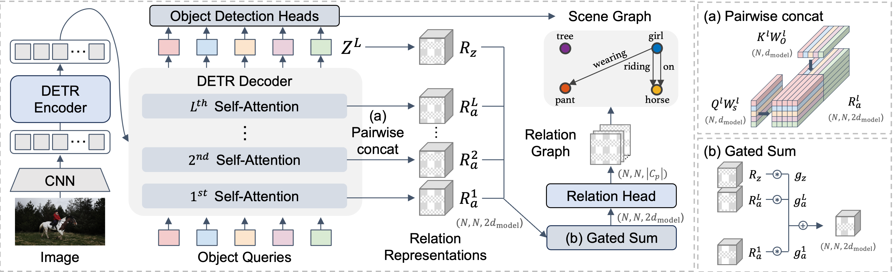

<div align="center">
    
# EGTR: Extracting Graph from Transformer for Scene Graph Generation [CVPR 2024 Best paper award candidate]

[](https://arxiv.org/abs/2404.02072)
[](https://openaccess.thecvf.com/content/CVPR2024/html/Im_EGTR_Extracting_Graph_from_Transformer_for_Scene_Graph_Generation_CVPR_2024_paper.html)
[](https://cvpr.thecvf.com/media/PosterPDFs/CVPR%202024/31166.png?t=1719244488.0932813)
[](https://cvpr.thecvf.com/media/cvpr-2024/Slides/32054_UhZdVUe.pdf)
[](https://www.youtube.com/watch?v=w4DWd3mp2Wk)

</div>

## Architecture

<p align="center"></p>

## Abstract
> Scene Graph Generation (SGG) is a challenging task of detecting objects and predicting relationships between objects. After DETR was developed, one-stage SGG models based on a one-stage object detector have been actively studied. However, complex modeling is used to predict the relationship between objects, and the inherent relationship between object queries learned in the multi-head self-attention of the object detector has been neglected. We propose a lightweight one-stage SGG model that extracts the relation graph from the various relationships learned in the multi-head self-attention layers of the DETR decoder. By fully utilizing the self-attention by-products, the relation graph can be extracted effectively with a shallow relation extraction head. Considering the dependency of the relation extraction task on the object detection task, we propose a novel relation smoothing technique that adjusts the relation label adaptively according to the quality of the detected objects. By the relation smoothing, the model is trained according to the continuous curriculum that focuses on object detection task at the beginning of training and performs multi-task learning as the object detection performance gradually improves. Furthermore, we propose a connectivity prediction task that predicts whether a relation exists between object pairs as an auxiliary task of the relation extraction. We demonstrate the effectiveness and efficiency of our method for the Visual Genome and Open Image V6 datasets. Our code is publicly available at https://github.com/naver-ai/egtr.

## Updates
- `2024-06-19`: Code and model checkpoints have been released. 🚀
- `2024-05-22`: EGTR is nominated as a best paper award candidate! 🏆 (24 / 2,719 = 0.9% of the accepted papers)
- `2024-04-04`: EGTR has been selected as an oral! 🎉 (90 / 2,719 = 3.3% of the accepted papers)
- `2024-02-26`: EGTR has been accepted to CVPR 2024! 🎉 (2,719 / 11,532 = 23.6% acceptance rate)

## Usage

### Install dependencies

Docker image: [nvcr.io/nvidia/pytorch:21.11-py3](http://nvcr.io/nvidia/pytorch:21.11-py3)

```
pip install -r requirements.txt
cd lib/fpn
sh make.sh
```

### Download dataset

EGTR is trained and evaluated on two representative SGG datasets: Visual Genome and Open Image V6. Please refer to below links.

- Visual Genome: https://github.com/yrcong/RelTR/blob/main/data/README.md
- Open Image V6: https://github.com/Scarecrow0/SGTR/blob/main/DATASET.md

The final directory structure will be as follows:
```
dataset
│   
└───visual_genome
│   │
│   └───images
│       train.json
│       val.json
│       test.json
│       rel.json
│   
└───open-imagev6
    │
    └───images
        annotations
```

### Prepare pre-trained object detector

To speed up convergence, we first pre-train the object detector with the target dataset. The pre-trained object detector can be downloaded using the following link. [[VG]](https://drive.google.com/file/d/1vEN-Nat8CtrqP9LoKj0llgUJjGoI7CX7/view?usp=drive_link) [[OI]](https://drive.google.com/file/d/1GsGsmYwHfZ55BJwBCWb9-_tovMfUmWBD/view?usp=drive_link)

(Optional) The object detector can be trained from scratch as follows:

1) Download the ResNet-50 backbone separately as below. These lines ([line1](https://github.com/huggingface/transformers/blob/v4.18.0/src/transformers/models/detr/modeling_detr.py#L1188), [line2](https://github.com/huggingface/transformers/blob/v4.18.0/src/transformers/models/detr/modeling_detr.py#L804-L809)) initialize the backbone.

```python
import torch
from transformers import PretrainedConfig
from transformers.models.detr.modeling_detr import DetrTimmConvEncoder, DetrConvModel, build_position_encoding

config = PretrainedConfig.from_pretrained("facebook/detr-resnet-50")
backbone = DetrTimmConvEncoder(config.backbone, config.dilation)
position_embeddings = build_position_encoding(config)
backbone = DetrConvModel(backbone, position_embeddings)
torch.save(backbone.state_dict(), f"{BACKBONE_DIRPATH}/resnet50.pt")
```
2) Train DETR as below.

```python
# Pre-train DETR (using 8 V100 gpus)
python pretrain_detr.py --data_path dataset/visual_genome --output_path $OUTPUT_PATH --backbone_dirpath $BACKBONE_DIRPATH --memo $MEMO
```

### Model train

We train EGTR using the pre-trained object detector. Trained EGTR can be downloaded at the following link. [[VG]](https://drive.google.com/file/d/18phcRxbrEI7HqIuM2OLAPuwAF5k3pUC2/view?usp=drive_link) [[OI]](https://drive.google.com/file/d/1JqWNwf1QvDsTbGFigEXXN_8qv3VF-lGP/view?usp=drive_link)

```python
# Train EGTR (using 8 V100 gpus)
python train_egtr.py --data_path dataset/visual_genome --output_path $OUTPUT_PATH --pretrained $PRETRAINED_PATH --memo $MEMO
```

### Model evaluation

```python
# Evaluate EGTR (using 1 V100 gpu)
python evaluate_egtr.py --data_path dataset/visual_genome --artifact_path $ARTIFACT_PATH
```

### FPS
```python
# Calculate FPS 
python evaluate_egtr.py --data_path dataset/visual_genome --artifact_path $ARTIFACT_PATH --min_size 600 --max_size 1000 --infer_only True
```
## Citation

```
@InProceedings{Im_2024_CVPR,
    author    = {Im, Jinbae and Nam, JeongYeon and Park, Nokyung and Lee, Hyungmin and Park, Seunghyun},
    title     = {EGTR: Extracting Graph from Transformer for Scene Graph Generation},
    booktitle = {Proceedings of the IEEE/CVF Conference on Computer Vision and Pattern Recognition (CVPR)},
    month     = {June},
    year      = {2024},
    pages     = {24229-24238}
}
```

## License

```
Copyright (c) 2024-present NAVER Cloud Corp.

Licensed under the Apache License, Version 2.0 (the "License");
you may not use this file except in compliance with the License.
You may obtain a copy of the License at

    http://www.apache.org/licenses/LICENSE-2.0

Unless required by applicable law or agreed to in writing, software
distributed under the License is distributed on an "AS IS" BASIS,
WITHOUT WARRANTIES OR CONDITIONS OF ANY KIND, either express or implied.
See the License for the specific language governing permissions and
limitations under the License.
```

## References
- https://github.com/rowanz/neural-motifs
- https://github.com/yuweihao/KERN
- https://github.com/SHTUPLUS/PySGG
- https://github.com/suprosanna/relationformer
- https://github.com/MCG-NJU/Structured-Sparse-RCNN
- https://github.com/facebookresearch/detr
- https://github.com/NielsRogge/Transformers-Tutorials/blob/master/DETR/Fine_tuning_DetrForObjectDetection_on_custom_dataset_(balloon).ipynb
- https://github.com/huggingface/transformers/blob/v4.18.0/src/transformers/models/detr/modeling_detr.py
- https://github.com/huggingface/transformers/tree/01eb34ab45a8895fbd9e335568290e5d0f5f4491/src/transformers/models/deformable_detr
